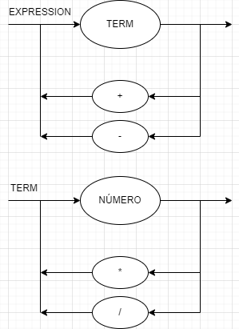

### Como rodar

Compilar usando o javac 15.0.2 (https://www.oracle.com/java/technologies/javase/jdk15-archive-downloads.html)

`javac exemplo.java`

Rodar usando

`java exemplo <args>`

### EBNF

`EXPRESSION = TERM, {("+" | "-"), TERM};`
`TERM = FACTOR, {("*" | "/"), FACTOR};`
`FACTOR = ("+" | "-") FACTOR | "(" EXPRESSION ")" | number;`

### DIAGRAMA

