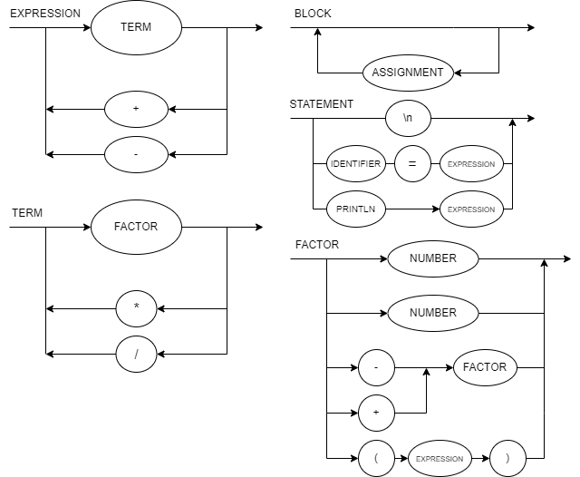

### Como rodar

Compilar usando o javac 15.0.2 (https://www.oracle.com/java/technologies/javase/jdk15-archive-downloads.html)

`javac exemplo.java`

Rodar usando

`java exemplo <args>`

### EBNF

`BLOCK = {STATEMENT};`

`STATEMENT = (λ | ASSIGNMENT | PRINT), "\n";`

`ASSIGNMENT = IDENTIFIER, "=", EXPRESSION;`

`PRINT = "println", "(", EXPRESSION, ")";`

`EXPRESSION = TERM, {("+" | "-"), TERM};`

`TERM = FACTOR, {("*" | "/"), FACTOR};`

`FACTOR = (("+" | "-"), FACTOR) | NUMBER | "(", EXPRESSION, ")" | IDENTIFIER;`

`IDENTIFIER = LETTER, {LETTER | DIGIT | "_"};`

`NUMBER = DIGIT, {DIGIT};`

`LETTER = (a | ... | z | A | ... | Z);`

`DIGIT = (1 | 2 | 3 | 4 | 5 | 6 | 7 | 8 | 9 | 0);`

### DIAGRAMA

